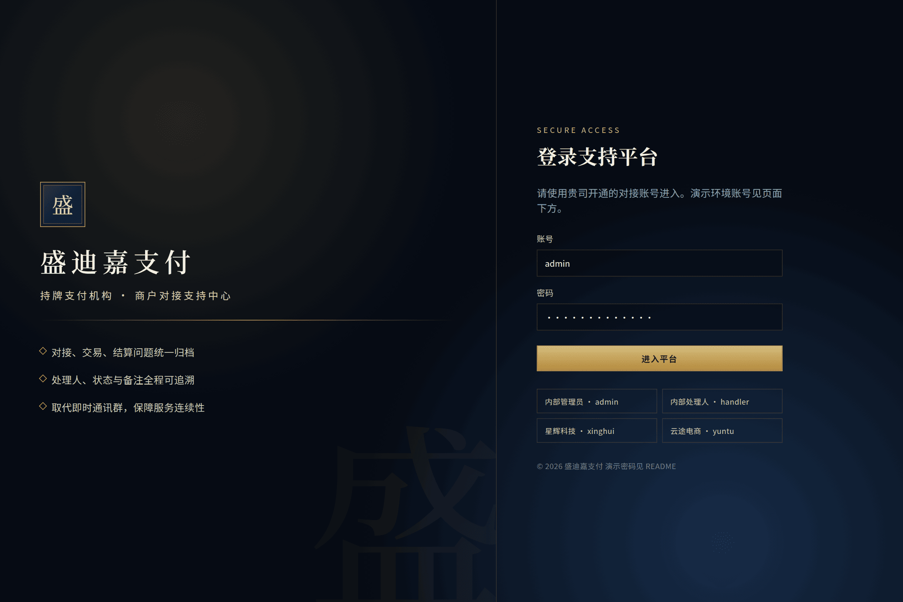
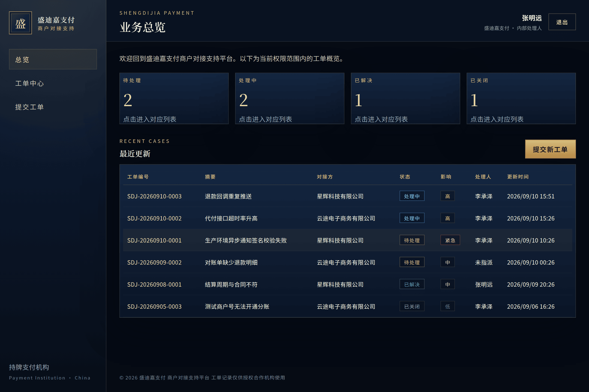
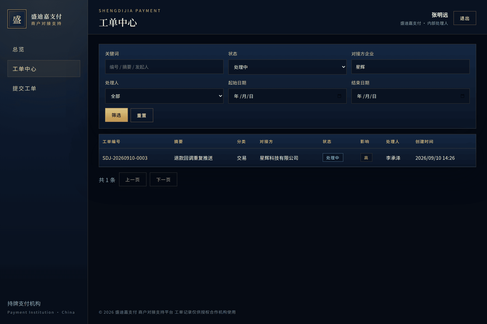
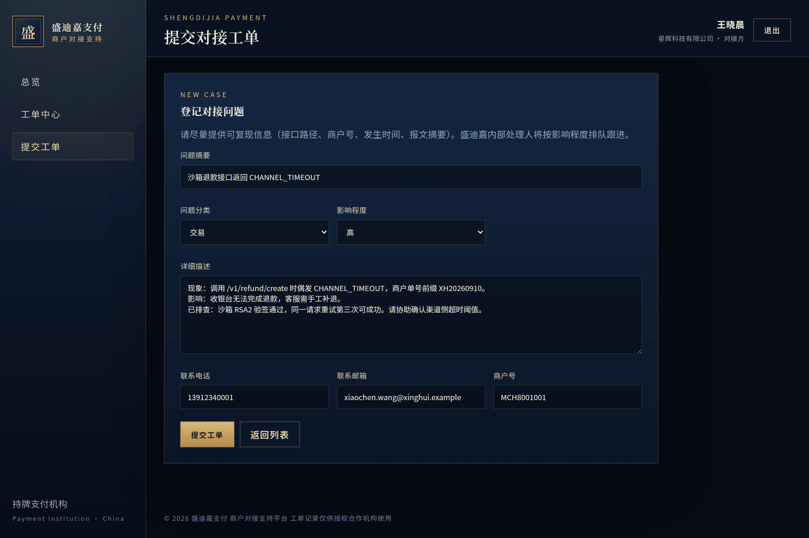
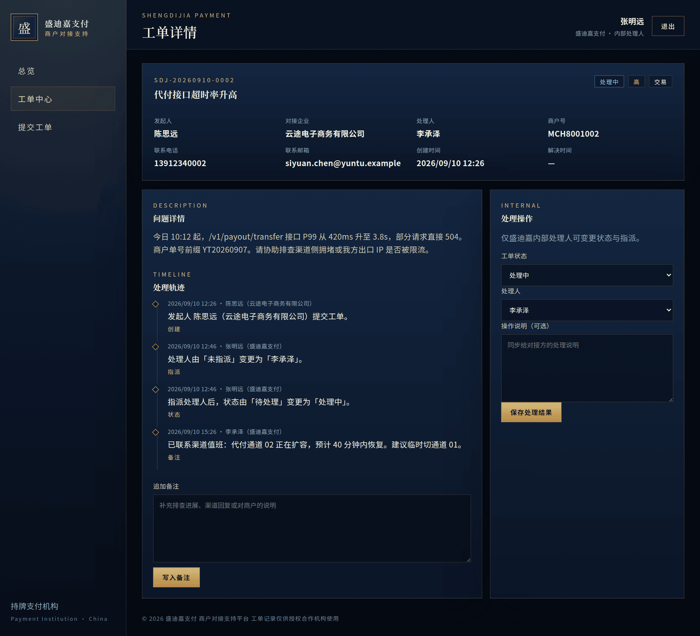
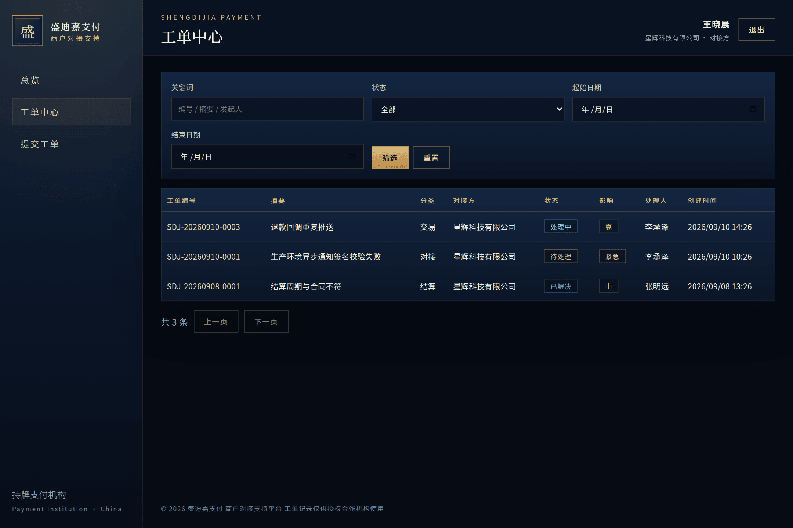

# 盛迪嘉支付 · 商户对接支持平台

持牌支付机构 **盛迪嘉支付** 用于对接方企业与内部处理人协同跟进支付 API 接入、交易与结算问题的工单系统。用以替代即时通讯群：问题可检索、状态可追踪、处理过程可留痕。

## 功能

- 对接方提交工单：摘要、详情、分类、影响程度、联系方式、商户号
- 工单列表：按状态、对接企业、处理人、日期、关键词筛选
- 工单详情：变更状态 / 指派处理人、追加备注、时间线
- 角色：对接方仅能查看本企业工单；内部处理人可查看并处理全部工单
- 总览：各状态数量、今日新增、最近更新
- 数据持久化于 MySQL，重启不丢失

## 界面演示

以下截图来自演示环境（中文界面，盛迪嘉支付品牌）。本地启动后访问 **http://localhost:8081** 即可看到同一套画面。

### 登录

打开系统后先进入登录页。左侧为机构介绍，右侧可直接点选演示账号填入。



### 总览

内部账号登录后进入「业务总览」：四个状态卡片可点进对应列表，下方为最近更新的工单。



### 工单列表与筛选

「工单中心」可按关键词、状态、对接企业、处理人、日期筛选。下图为内部处理人按「处理中 + 星辉」筛出的结果。



### 提交工单

对接方在「提交工单」中填写摘要、分类、影响程度、详情与联系方式。联系电话 / 邮箱 / 商户号会按账号资料预填，可再修改。



### 工单详情与处理轨迹

点开工单可查看问题详情、时间线（创建 / 指派 / 状态 / 备注）以及追加备注。内部处理人右侧还有改状态、指派处理人的操作区。



### 对接方视角

对接方账号只能看到本企业工单，筛选区也没有「对接方企业 / 处理人」两项。下图为星辉科技账号 `xinghui` 的列表。



## 操作指引

面向业务同事：不需要安装开发工具，按下面顺序即可走通一遍。演示密码见下方「演示账号」。

1. **登录**  
   浏览器打开 **http://localhost:8081**（服务器则为 **http://IP:8081**）。  
   - 想看内部处理界面：点「内部管理员 · admin」，再点「进入平台」。  
   - 想看对接方界面：点「星辉科技 · xinghui」或「云途电商 · yuntu」。

2. **看看板**  
   登录后默认在「总览」。四个数字分别是待处理 / 处理中 / 已解决 / 已关闭；点卡片会跳到带对应状态筛选的列表。「最近更新」可直接点进某张工单。

3. **创建工单**  
   左侧点「提交工单」（或总览里的「提交新工单」）。填写一句话摘要、分类（对接 / 交易 / 结算 / 其他）、影响程度，并写清现象、影响和已做排查。提交后会进入该工单详情。  
   建议用对接方账号练习，例如 `xinghui` / `Sdj@Partner2026`。

4. **筛选列表**  
   打开「工单中心」。可按编号、摘要、发起人关键词搜索，也可限定状态与日期。内部账号还能按对接企业名称、处理人过滤。点「筛选」应用，点「重置」清空。

5. **处理、改状态、加备注**  
   在工单详情底部「追加备注」写入进展，点「写入备注」，会记入时间线。  
   内部处理人（`admin` / `handler`）还可在右侧「处理操作」中：  
   - 把状态改为处理中 / 已解决 / 已关闭；  
   - 指派处理人（演示数据里为张明远、李承泽）；  
   - 填写给对接方看的操作说明，再点「保存处理结果」。  
   对接方看不到右侧处理区，但仍可补充备注。

6. **对接方与内部角色差异**  

   | | 对接方 `xinghui` / `yuntu` | 内部 `admin` / `handler` |
   | --- | --- | --- |
   | 能看到的工单 | 仅本企业 | 全部对接企业 |
   | 列表筛选 | 关键词、状态、日期 | 另可按企业、处理人 |
   | 提交工单 | 可以 | 可以 |
   | 改状态 / 指派处理人 | 不可以 | 可以 |
   | 追加备注 | 可以 | 可以 |

   对比方法：用 `xinghui` 看列表（只有星辉科技），退出后再用 `admin` 登录，即可看到星辉与云途的全部工单，并在详情右侧进行指派与结案。

## 一键启动（推荐）

需要本机已安装 Docker 与 Docker Compose。

```bash
docker compose up -d --build
```

浏览器访问：**http://localhost:8081**（云服务器为 **http://IP:8081**）

停止：

```bash
docker compose down
```

数据卷 `sdj_mysql_data` 会保留工单。若要清空演示数据：`docker compose down -v`。

## 演示账号

| 角色 | 账号 | 密码 | 所属 |
| --- | --- | --- | --- |
| 内部管理员 | `admin` | `Sdj@Admin2026` | 盛迪嘉支付 |
| 内部处理人 | `handler` | `Sdj@Handler2026` | 盛迪嘉支付 |
| 对接方 | `xinghui` | `Sdj@Partner2026` | 星辉科技有限公司 |
| 对接方 | `yuntu` | `Sdj@Partner2026` | 云途电子商务有限公司 |

首次启动会写入若干演示工单，打开列表即可看到数据。日常怎么点，见上方「操作指引」。

## 本地开发

环境：JDK 21、Maven 3.9+、Node.js 20+、MySQL 8。

```sql
CREATE DATABASE sdj_support CHARACTER SET utf8mb4 COLLATE utf8mb4_unicode_ci;
CREATE USER 'sdj'@'%' IDENTIFIED BY 'sdj_pass_2026';
GRANT ALL ON sdj_support.* TO 'sdj'@'%';
```

启动后端：

```bash
cd backend
mvn spring-boot:run
```

启动前端（开发时代理 `/api` 到 8080）：

```bash
cd frontend
npm install
npm run dev
```

开发界面：http://localhost:5173  
生产打包后由 Spring Boot 在 **8080** 提供同一站点：

```bash
cd frontend
npm install
npm run build
# 产物默认输出到 backend/src/main/resources/static
cd ../backend
mvn spring-boot:run
```

可通过环境变量覆盖数据源：

- `SPRING_DATASOURCE_URL`
- `SPRING_DATASOURCE_USERNAME`
- `SPRING_DATASOURCE_PASSWORD`
- `SERVER_PORT`（默认 8080）

## 部署说明

1. 在服务器安装 Docker，将本仓库同步到目标目录。
2. 按需修改 `docker-compose.yml` 中的数据库密码与端口映射。
3. 执行 `docker compose up -d --build`。
4. 将 8081 置于 HTTPS 反向代理（Nginx / 网关）之后，再对合作机构开放。
5. 生产环境请立即修改演示账号密码，并关闭或替换种子数据（`APP_SEED=false` 可跳过重复种子；仅在用户表为空时写入）。

应用健康检查：`GET /api/health`。

## 字段说明

| 字段 | 含义 |
| --- | --- |
| 工单编号 | 形如 `SDJ-20260907-0001`，按日递增 |
| 摘要 | 问题一句话标题 |
| 详情 | 现象、影响、已做排查 |
| 发起人 | 提交人姓名与所属企业 |
| 处理人 | 盛迪嘉内部跟进人 |
| 状态 | 待处理 / 处理中 / 已解决 / 已关闭 |
| 影响程度 | 低 / 中 / 高 / 紧急 |
| 分类 | 对接 / 交易 / 结算 / 其他 |
| 商户号 | 相关商户 ID，可选 |
| 备注 | 可多次追加，形成时间线 |
| 创建 / 更新 / 解决时间 | 系统自动维护；进入已解决或已关闭时写入解决时间 |

## 技术栈

- 后端：Java 21、Spring Boot 3.4、Spring Security（Session）、Spring Data JPA、Flyway
- 前端：Vue 3、Vite（中文界面，夜蓝金配色）
- 数据库：MySQL 8.4

## 项目结构

```
backend/     Spring Boot API 与打包后的前端静态资源
frontend/    Vue 3 单页应用
docs/        界面演示截图（README 引用）
Dockerfile   多阶段构建（Node 打包前端 + Maven 打包后端）
docker-compose.yml   应用 + MySQL
```
